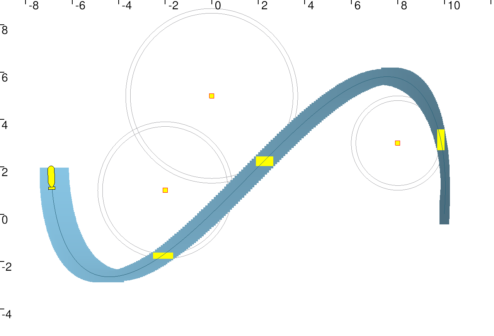

# Localization with asynchonous measurements
---

## Instructions

To run the code you need to install  [Tubex](http://simon-rohou.fr/research/tubex-lib/doc/index.html) for solving interval tubes and the graphical tool  [VIbes](http://simon-rohou.fr/research/tubex-lib/doc/install/01-installation.html#graphical-tools) viewer.

** Installing Tubex and its dependencies  **
see [here](http://simon-rohou.fr/research/tubex-lib/doc/install/01-installation-full-linux.html#installing-tubex-on-linux-for-c-use)


** Installing graphical tool  **

On Linux systems, a fast installation can be made using the following command lines:
```bash
 sudo apt-get install qt5-default libqt5svg5-dev cmake git
 git clone https://github.com/ENSTABretagneRobotics/VIBES
 cd VIBES/viewer ; mkdir build ; cd build ; cmake .. ; sudo make install
```
On terminal,  launch it using
```bash
  VIBes-viewer
```
---

### Launch

After installing, you can launch the code using
```bash
  cd build
  cmake ..
  make
  ./Asynch_measure
```

You should obtain this figure:


 


 


