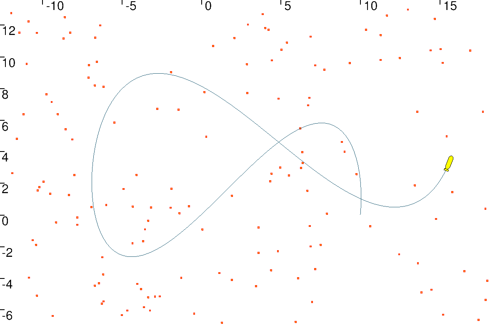

# Dynamic localization with data association

 In this situation, the robot does not have any knowledge about its initial position. It evolves in an environment made of a set of landmarks that are all indistinguishable. The measurements to these landmarks consist in range-and-bearing data. The map is known a priori.

## Instructions

To run the code you need to install  [Tubex](http://simon-rohou.fr/research/tubex-lib/doc/index.html) for solving interval tubes and the graphical tool  [VIbes](http://simon-rohou.fr/research/tubex-lib/doc/install/01-installation.html#graphical-tools) viewer.  To do so, see the instructions [here](https://github.com/jad-rabehi/Constraint-programming#instructions).


### Launch

Launch the graphical viewer first using:
```bash
  VIBes-viewer
```
---
Then, launch the code with:
```bash
  cd build
  cmake ..
  make
  ./Data_association
```


You should obtain the following :

<p align="center">
  
</p>

* this figure shows the position estimation of the robot (localization) while associating the  detected landmarks with the map.


