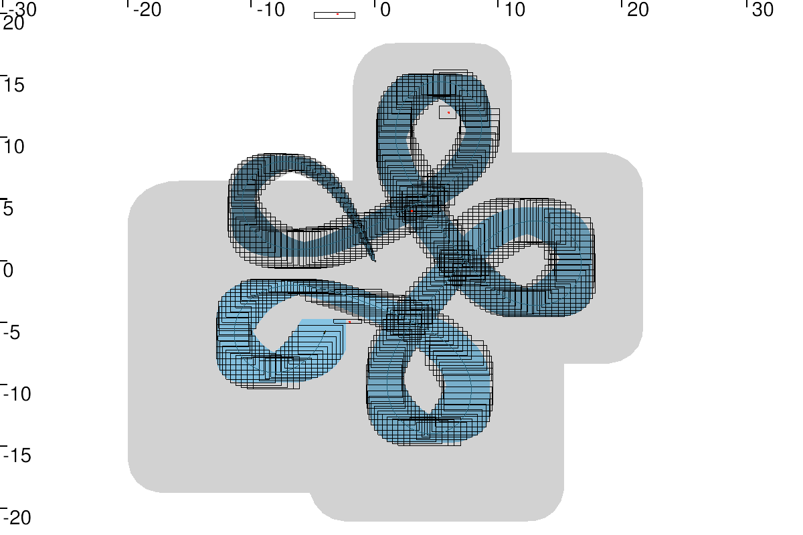
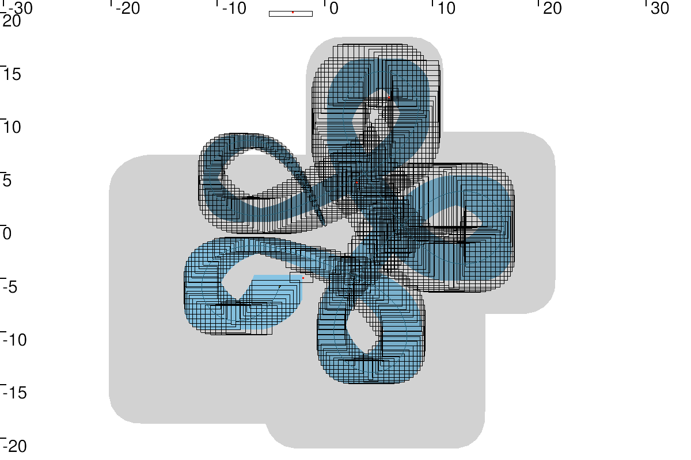

# Online Range-only SLAM
---

In the [Range-only SLAM](https://github.com/jad-rabehi/Constraint-programming/tree/main/Range_Only_SLAM), it is assuming that all the data (measurements) were collected before running the solver.

This approach could also be used online and make the solver run during the evolution of the robot.

The difference is that at time  *t*, the **online SLAM** does not take benefit from future measurements, while the **offline SLAM** was able to propagate all information forward and backward in time. 

## Instructions

To run the code you need to install  [Tubex](http://simon-rohou.fr/research/tubex-lib/doc/index.html) for solving interval tubes and the graphical tool  [VIbes](http://simon-rohou.fr/research/tubex-lib/doc/install/01-installation.html#graphical-tools) viewer.  To do so, see the instructions [here](https://github.com/jad-rabehi/Constraint-programming#instructions).


### Launch

Launch the graphical viewer first using:
```bash
  VIBes-viewer
```
---
Then, launch the code with:
```bash
  cd build
  cmake ..
  make
  ./Online_Range_SLAM
```


You should obtain these figures:

<p align="center">
  
</p>

* the 1st figure shows the Online Range SLAM with ``` iteration_dt =1 ``` 

<p align="center">

<p/>

* the 2nd figure shows the Online Range SLAM with ``` iteration_dt =0.5 ```


<p align="center">

<p/>

* the 3rd figure shows the Online Range SLAM with ``` iteration_dt =0.2 ```


