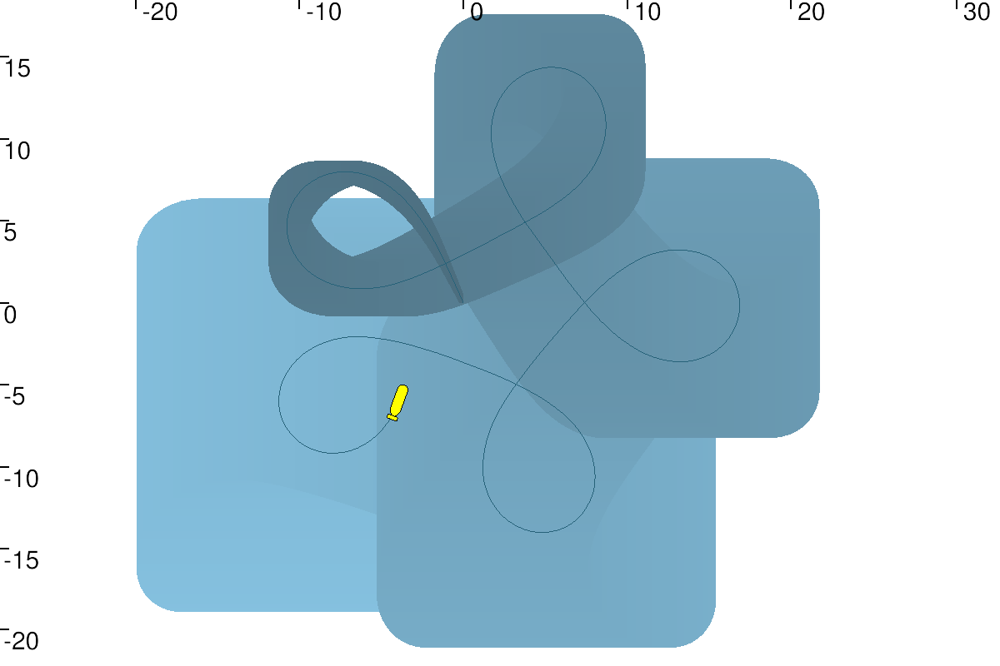
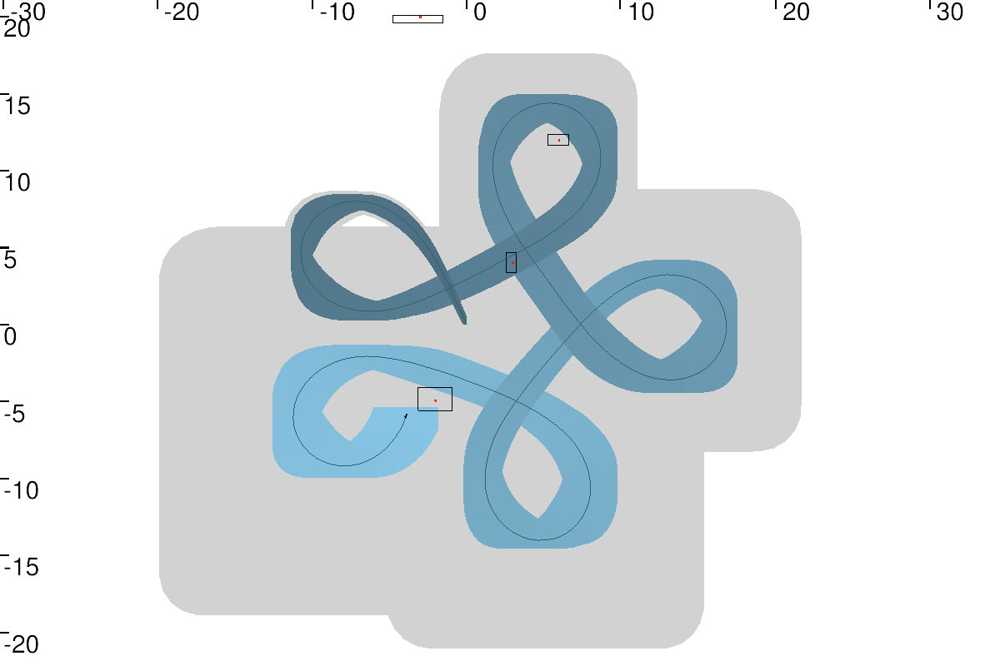

# Range-only SLAM

 Here,  the concepts of constraints and interval analysis on a concrete Simultaneous Localization and Mapping (SLAM) problem is applied.

## Instructions

To run the code you need to install  [Tubex](http://simon-rohou.fr/research/tubex-lib/doc/index.html) for solving interval tubes and the graphical tool  [VIbes](http://simon-rohou.fr/research/tubex-lib/doc/install/01-installation.html#graphical-tools) viewer.  To do so, see the instructions [here](https://github.com/jad-rabehi/Constraint-programming#instructions).


### Launch

Launch the graphical viewer first using:
```bash
  VIBes-viewer
```
---
Then, launch the code with:
```bash
  cd build
  cmake ..
  make
  ./Range\_Only\_SLAM
```


You should obtain these figures:

the fist figure is the deadrecking localization based on the knowledge of initial position the evolution of the robot



the second figure is the SLAM using only range measurements, in which intervals for both robot pose and beacons positions are obtained (contrated) using contractors




